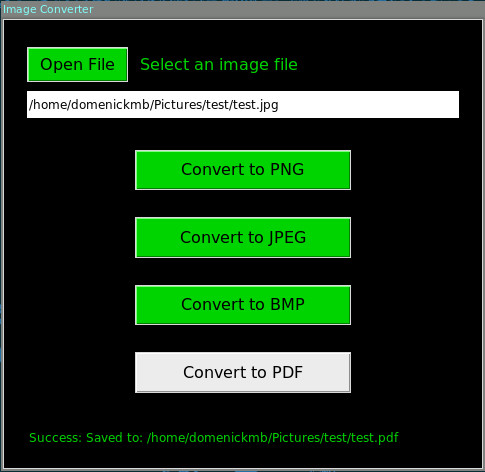

# ImageConverter

### Description

Image Converter app implemented in python using tkinter. It has the option to convert some known image formats into JPEG, PNG, BMP, and PDF formats.

***

### Prerequisite
The image_converter.py depends on the Pillow library, so it needs to be installed first.
```
$ pip install Pillow
```

***

### Running the program
Double click the file or open a terminal and `cd` to image_converter directory and type:  
```
$ python image_converter.py
```

***

### Screenshot

